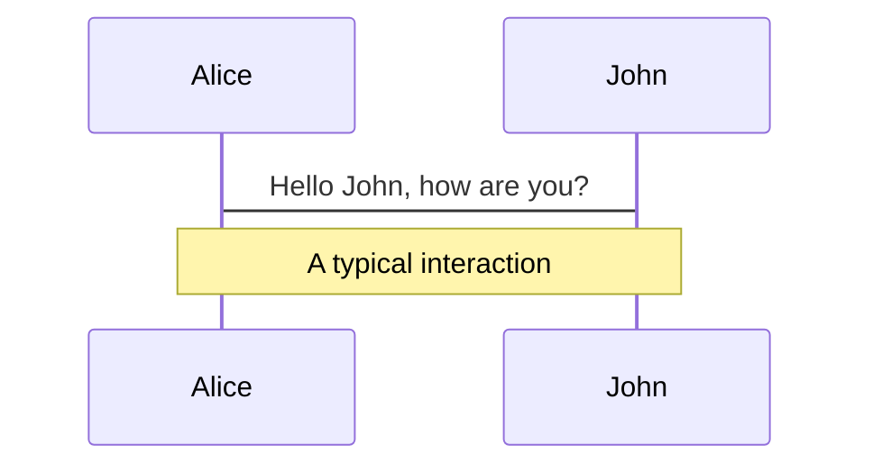
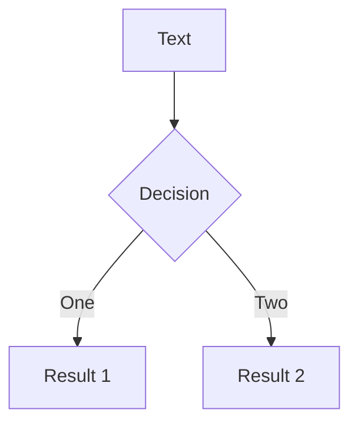
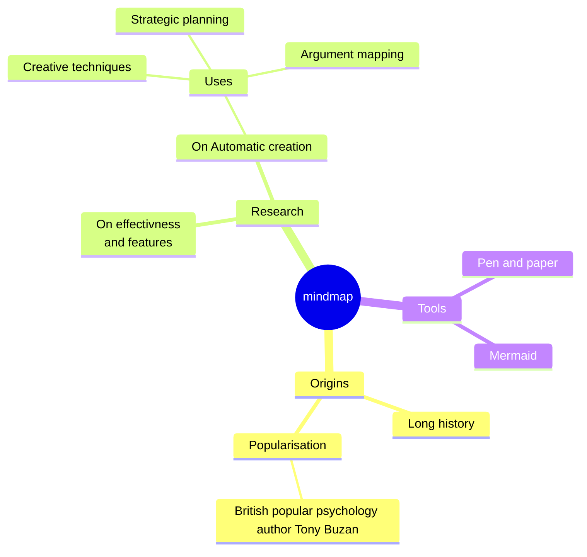
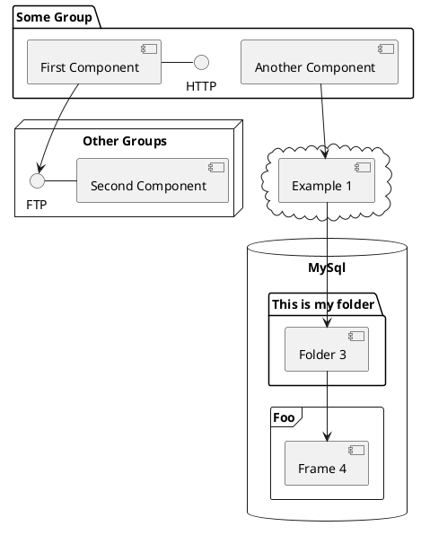

# Mini Bundler

最小的打包器

<!-- <div class="pt-12">
  <span @click="$slidev.nav.next" class="px-2 py-1 rounded cursor-pointer" hover="bg-white bg-opacity-10">
    Press Space for next page <carbon:arrow-right class="inline"/>
  </span>
</div> -->

<!-- <div class="abs-br m-6 flex gap-2">
  <button @click="$slidev.nav.openInEditor()" title="Open in Editor" class="text-xl slidev-icon-btn opacity-50 !border-none !hover:text-white">
    <carbon:edit />
  </button>
  <a href="https://github.com/slidevjs/slidev" target="_blank" alt="GitHub"
    class="text-xl slidev-icon-btn opacity-50 !border-none !hover:text-white">
    <carbon-logo-github />
  </a>
</div> -->


---
transition: fade-out
title: 什么是 Bundler

---

# 什么是 Bundler

bundlers let us write  modules  that work in  the browsers

- **CommonJS** - CJS 

- **ECMA Script Module** - esm  js 标准模块

- **Universal Module Definition** - 通用模块定义 [umd](https://github.com/umdjs/umd)


<!--

使用哪种模块 
需要 衡量

esm  默认支持

umd  通用 为什么不直接 只提供 umd 包

-->

<style>
h1 {
  background-color: #2B90B6;
  background-image: linear-gradient(45deg, #4EC5D4 10%, #146b8c 20%);
  background-size: 100%;
  -webkit-background-clip: text;
  -moz-background-clip: text;
  -webkit-text-fill-color: transparent;
  -moz-text-fill-color: transparent;
}
</style>

<!--
Here is another comment .
-->
---
transition: fade-out
title: 模块示例
---


<div> 
esm

```ts 
import _ from 'lodash';

// some code...

export default value
```
</div>

<br>
<br>

<div>
cjs

```ts 
const _ = require('lodash');

// some code...

module.exports = someValue
```

</div>


---
title: umd
---
<div>
umd

```ts 
(function (root, factory) {
  if (typeof define === 'function' && define.amd) {
    define([], factory);
  } else if (typeof module === 'object' && module.exports) {
    module.exports = factory();
  } else {
    root.mathLibrary = factory();
  }
}(typeof self !== 'undefined' ? self : this, function () {
  // 实际的库代码
  function add(a, b) {
    return a + b;
  }

  return {
    add: add
  };
}));

```

</div>
---

## 为什么需要 Bundler

<br>

- Reducing HTTP requests. 减少 httpRequest 

A single package in node_modules may consist of hundreds of files, and large applications may have dozens of such dependencies. Loading each of these files with a separate HTTP request becomes untenable very quickly, so bundlers are used to convert our application source code into a smaller number of self-contained "bundles" that can be loaded with a single request.

- Code transforms.  代码转换

Modern apps are commonly built with languages or tools like TypeScript, JSX, and CSS modules, all of which must be converted into plain JavaScript and CSS before they can be consumed by a browser. The bundler is the natural place to configure these transformations.

- Framework features.  框架特性

Frameworks rely on bundler plugins & code transformations to implement common patterns like file-system routing, client-server code co-location (think getServerSideProps or Remix loaders), and server components.


---
transition: slide-up
layout: center


---

# Let's Code

<!-- 
  TODO: 这里关于代码的文件

 -->


---
layout: image-right
image: https://source.unsplash.com/collection/94734566/1920x1080
---

# Code

Use code snippets and get the highlighting directly![^1]

```ts {all|2|1-6|9|all}
interface User {
  id: number
  firstName: string
  lastName: string
  role: string
}

function updateUser(id: number, update: User) {
  const user = getUser(id)
  const newUser = { ...user, ...update }
  saveUser(id, newUser)
}
```

<arrow v-click="3" x1="400" y1="420" x2="230" y2="330" color="#564" width="3" arrowSize="1" />


<style>
.footnotes-sep {
  @apply mt-20 opacity-10;
}
.footnotes {
  @apply text-sm opacity-75;
}
.footnote-backref {
  display: none;
}
</style>

---

# Components


<div>

You can use Vue components directly inside your slides.

We have provided a few built-in components like `<Tweet/>` and `<Youtube/>` that you can use directly. And adding your custom components is also super easy.

```html
<Counter :count="10" />
```

<!-- ./components/Counter.vue -->
<Counter :count="10" m="t-4" />

Check out [the guides](https://sli.dev/builtin/components.html) for more.

</div>


<!--
Presenter note with **bold**, *italic*, and ~~striked~~ text.

Also, HTML elements are valid:
<div class="flex w-full">
  <span style="flex-grow: 1;">Left content</span>
  <span>Right content</span>
</div>
-->


---
class: px-20
---

# Themes

Slidev comes with powerful theming support. Themes can provide styles, layouts, components, or even configurations for tools. Switching between themes by just **one edit** in your frontmatter:

<div grid="~ cols-2 gap-2" m="-t-2">

```yaml
---
theme: default
---
```

```yaml
---
theme: seriph
---
```


</div>

Read more about [How to use a theme](https://sli.dev/themes/use.html) and
check out the [Awesome Themes Gallery](https://sli.dev/themes/gallery.html).

---
preload: false
---

# Animations

Animations are powered by [@vueuse/motion](https://motion.vueuse.org/).

```html
<div
  v-motion
  :initial="{ x: -80 }"
  :enter="{ x: 0 }">
  Slidev
</div>
```

<div class="w-60 relative mt-6">
  <div class="relative w-40 h-40">
    
    
    
  </div>

  <div
    class="text-5xl absolute top-14 left-40 text-[#2B90B6] -z-1"
    v-motion
    :initial="{ x: -80, opacity: 0}"
    :enter="{ x: 0, opacity: 1, transition: { delay: 2000, duration: 1000 } }">
    Slidev
  </div>
</div>

<!-- vue script setup scripts can be directly used in markdown, and will only affects current page -->
<script setup lang="ts">
const final = {
  x: 0,
  y: 0,
  rotate: 0,
  scale: 1,
  transition: {
    type: 'spring',
    damping: 10,
    stiffness: 20,
    mass: 2
  }
}
</script>

<div
  v-motion
  :initial="{ x:35, y: 40, opacity: 0}"
  :enter="{ y: 0, opacity: 1, transition: { delay: 3500 } }">

<!-- [Learn More](https://sli.dev/guide/animations.html#motion) -->

</div>

---

# LaTeX

LaTeX is supported out-of-box powered by [KaTeX](https://katex.org/).

<br>

Inline $\sqrt{3x-1}+(1+x)^2$

Block
$$
\begin{array}{c}

\nabla \times \vec{\mathbf{B}} -\, \frac1c\, \frac{\partial\vec{\mathbf{E}}}{\partial t} &
= \frac{4\pi}{c}\vec{\mathbf{j}}    \nabla \cdot \vec{\mathbf{E}} & = 4 \pi \rho \\

\nabla \times \vec{\mathbf{E}}\, +\, \frac1c\, \frac{\partial\vec{\mathbf{B}}}{\partial t} & = \vec{\mathbf{0}} \\

\nabla \cdot \vec{\mathbf{B}} & = 0

\end{array}
$$

<br>


---

# Diagrams

You can create diagrams / graphs from textual descriptions, directly in your Markdown.

<div class="grid grid-cols-4 gap-5 pt-4 -mb-6">









</div>


---
src: ./pages/multiple-entries.md
hide: false
---

---
layout: center
class: text-center
---

# Thank You !

<!-- [Documentations](https://sli.dev) · [GitHub](https://github.com/slidevjs/slidev) · [Showcases](https://sli.dev/showcases.html) -->
